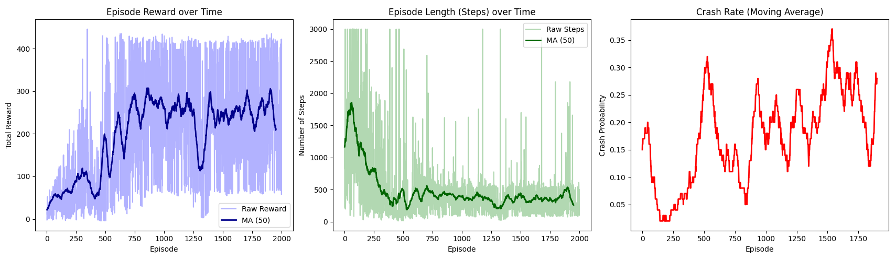

<div align="center">

# 🚗 Safe Driving with Deep Q-Networks in MetaDrive

**A DQN agent that learns to drive — and stay alive — in the [MetaDrive](https://github.com/metadriverse/metadrive) simulator.**

[](https://www.python.org/)
[](https://pytorch.org/)
[](https://github.com/metadriverse/metadrive)
[](LICENSE)



</div>

---

## 📖 Overview

This project implements a **Deep Q-Network (DQN)** agent from scratch and trains it inside `MetaDriveEnv`, a realistic procedurally-generated driving simulator. The agent learns to choose among **6 discrete driving actions** (steering × throttle/brake combinations) with the goal of maximizing reward while minimizing unsafe behavior such as collisions and off-road excursions.

It follows the full DQN pipeline: Q-network → experience replay → epsilon-greedy exploration → Bellman target → training loop → evaluation.

## ✨ Highlights

| Component | Detail |
|---|---|
| 🧠 **Network** | 2 hidden fully-connected layers (64 units), ReLU activations, `state → hidden → hidden → 6 Q-values` |
| 🔁 **Replay Buffer** | Capacity 10,000 transitions, uniform random mini-batch sampling (batch size 64) |
| 🎯 **Exploration** | Epsilon-greedy, decaying `1.0 → 0.01` at a rate of `0.997` per episode |
| 📉 **Target** | Bellman equation with a periodically-synced target network |
| 🛡️ **Safety cutoff** | Episodes force-truncated at 3000 steps to prevent stalled/frozen rollouts from polluting the buffer |
| 🗺️ **Evaluation** | Held-out map seed, top-down + 3D rendering, 1200-step timeout |

## 🎮 Action Space

The agent outputs a discrete action index, which is mapped to a continuous `[steering, throttle/brake]` command expected by MetaDrive:

| Index | Meaning | Continuous Action |
|:---:|---|:---:|
| 0 | Left + Brake | `[-1, -1]` |
| 1 | Left + Forward | `[-1, 1]` |
| 2 | Straight + Brake | `[0, -1]` |
| 3 | Straight + Forward | `[0, 1]` |
| 4 | Right + Brake | `[1, -1]` |
| 5 | Right + Forward | `[1, 1]` |

## 📂 Project Structure

```
.
├── src/
│   ├── env_utils.py       # MetaDrive config, observation flattening, action mapping
│   ├── network.py         # DQNNetwork (the Q-function)
│   ├── replay_buffer.py   # ReplayBuffer for experience replay
│   ├── agent.py           # DQNAgent: action selection, learning, target updates
│   ├── train.py           # Training loop (Task 6 & 7)
│   ├── evaluate.py        # Policy evaluation + rendering (Task 8)
│   └── plotting.py        # Reward / episode length / crash-rate plots
├── models/
│   └── dqn_trained.pt     # Final trained Q-network weights
├── assets/
│   └── training_results.png
├── requirements.txt
└── LICENSE
```

## 🚀 Getting Started

### 1. Install dependencies

```bash
pip install -r requirements.txt
```

> **Note:** `pip install metadrive-simulator` pulls the package from PyPI, which may lag behind the latest fixes. For the most up-to-date version, install directly from source instead:
> ```bash
> git clone https://github.com/metadriverse/metadrive.git
> cd metadrive && pip install -e .
> ```

### 2. Train the agent

```bash
python -m src.train
```

This runs training for `EPISODES` (default 1000), checkpoints the model every 100 episodes into `models/`, and saves the final weights to `models/dqn_trained.pt`. Training curves are plotted automatically at the end.

### 3. Evaluate the trained policy

```bash
python -m src.evaluate
```

Runs 10 evaluation episodes on an **unseen map seed**, rendering a top-down view and reporting average reward, average episode length, and crash rate.

## 📊 Results & Analysis

Training was run for ~2000 episodes. The plots above (`assets/training_results.png`) show three metrics tracked per episode: total reward, episode length, and a moving-average crash rate.

**Does the reward improve over time?**
Yes — a clear upward trend. The reward is low and noisy during the initial exploration phase (episodes 0–500), then the moving average climbs and stabilizes around **~250–300** in later episodes, indicating the agent is successfully learning a productive driving policy.

**Does the episode length change?**
Yes, it decreases substantially. Early on, the untrained agent frequently hits the 3000-step safety cutoff — a sign of overly conservative behavior (e.g., stalling to avoid crash penalties). After ~episode 500, episode length drops and stabilizes around **300–500 steps**, showing the agent has learned to drive forward purposefully instead of freezing.

**Does the crash rate decrease?**
It fluctuates rather than monotonically decreasing, revealing a **speed vs. safety trade-off**. The crash rate initially drops as the agent learns to avoid walls, but rises again to ~30–35% in later episodes as the agent adopts a faster, higher-reward driving style. Higher speed means less margin for error in tight corners — a textbook exploitation trade-off in reinforcement learning.

## 🧩 Implementation Notes

- **Kill-switch:** Episodes exceeding 3000 steps during training are force-ended and flagged as unsafe. This stops the agent from getting stuck in a "safe but useless" standstill policy and keeps the replay buffer free of degenerate transitions.
- **Evaluation protocol:** Evaluation uses a different `start_seed` than training, so reported performance reflects generalization to unseen maps rather than memorization.

